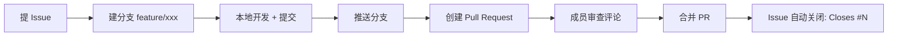

# 比赛协作指南（GitHub 全功能）

> 本文档是团队协作的**操作手册**，也是本项目协作痕迹的说明文件。
> 每一步都在本仓库留下了真实历史（Issues / PR / 提交 / 评论 / CI 记录），可直接作为比赛协作证明。

## 1. 仓库状态

- 仓库：`trixster2/AAAguosai`（**私有 Private**，仅协作者可见，比赛对手无法查看）
- 默认分支：`main`
- 协作证据：下方各节的链接即痕迹

## 2. 基础功能

| 功能 | 入口 | 用法 |
|---|---|---|
| Issues | 仓库顶栏 **Issues** | 记录任务/Bug/需求，可加标签、里程碑、指派成员 |
| Pull Requests | 顶栏 **Pull Requests** | 分支合并入口 + 代码审查 |
| Actions | 顶栏 **Actions** | CI/CD 自动检查（已配置 ci.yml） |
| Projects | 顶栏 **Projects** | 看板管理任务进度 |
| Discussions | 顶栏 **Discussions** | 自由讨论、Q&A（首次发帖需在网页端点击 New discussion） |
| Wiki | 顶栏 **Wiki** | 团队文档库。**注意**：若 Wiki 未启用，需仓库 Settings → General → Features 勾选 Wiki 保存后即可使用 |
| Releases | 主页右侧 **Releases** | 版本发布与 changelog |

## 3. 标准协作流程（Issue → 分支 → PR → 审查 → 合并）



### 3.1 提 Issue
```bash
gh issue create --title "任务标题" --body "背景与验收标准" \
  --label enhancement --milestone "阶段一" --assignee "@me"
```

### 3.2 建分支与开发
```bash
git switch main
git checkout -b feature/任务名        # feature/ fix/ docs/ ci/ 前缀
# 开发完成后
git add .
git commit -m "feat: 实现 xxx 功能，Closes #编号"
git push -u origin 分支名
```

### 3.3 提 PR 与审查
```bash
gh pr create --base main --head feature/任务名 --title "标题" --body "Closes #编号"
gh pr view --web                        # 网页端写行内评论
gh pr review 编号 --comment -b "评审意见"
gh pr review 编号 --approve -b "LGTM"   # 不能 approve 自己的 PR（规范要求交叉审查）
```

### 3.4 三种合并方式（本仓库均有真实样例）
| 方式 | 命令 | 历史效果 | 样例 |
|---|---|---|---|
| Merge commit | `gh pr merge 4 --merge` | 保留完整分支历史 | PR #4 |
| Squash | `gh pr merge 5 --squash` | 压缩为一个提交 | PR #5 |
| Rebase | `gh pr merge 6 --rebase` | 线性历史 | PR #6 |

## 4. CI 自动化（GitHub Actions）
- 工作流文件：`.github/workflows/ci.yml`
- 触发条件：push 到 main、所有 PR
- 查看：**Actions** 标签页 → 每次运行都有记录（绿色 ✓ / 红色 ✗）
- 添加新检查：在 `.github/workflows/` 下新增 yml 即可

## 5. 版本发布
```bash
git tag v0.1.0
git push origin v0.1.0
gh release create v0.1.0 --title "v0.1.0" --notes "变更说明"
```

## 6. 添加协作者
```bash
gh api -X PUT repos/trixster2/AAAguosai/collaborators/<对方用户名> -f permission=push
# 或在网页端 Settings → Collaborators → Add people
```
对方登录后即可 `git clone`（私有仓库需要权限）。

## 7. 分支保护（进阶，需付费版）
免费版**私有仓库**不支持分支保护规则（显示需升级 Pro/Team）。
公开仓库或付费版可在 Settings → Branches → Add rule 配置：
- 要求 PR 审查通过后才能合并
- 要求 CI 检查通过（`Status checks` 选择 CI 工作流）

## 8. 提交信息规范
```
feat:    新功能
fix:     修复
docs:    文档
ci:      CI 相关
chore:   杂项
style:   格式
refactor:重构
```

## 9. 安全提醒
- 私有仓库也不能提交密钥（token、密码、.env 真实值）
- CI 里配置了敏感文件检查，误提交会被拦下
- 比赛期间保持私有；赛后可自行决定是否公开

## 10. 本仓库痕迹速览（证据）
- Issues：#1（已关闭）、#2（已关闭）、#3
- PR：#4（merge）、#5（squash）、#6（rebase）
- 行内审查评论：PR #4 README.md 第 31 行
- CI 运行记录：Actions 标签页
- Release：v0.1.0